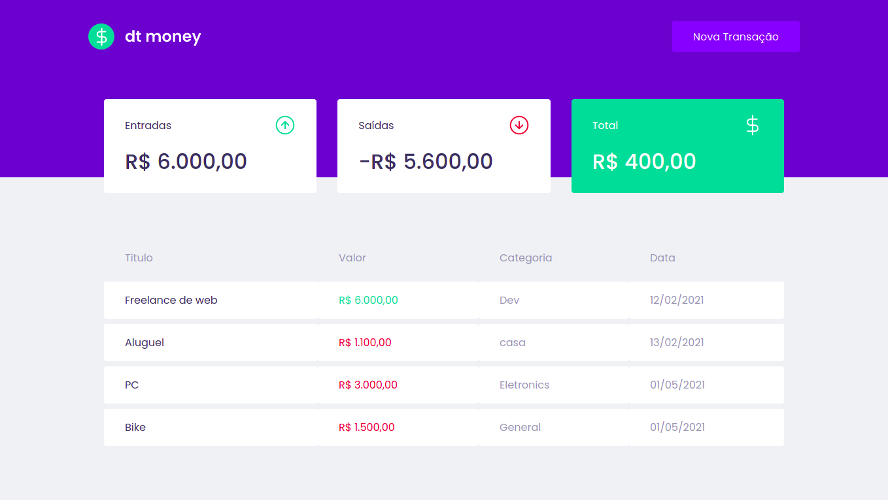

# ggMoney

<h4 align="center">
  An app for such a simple financial control that you can say that is "GG easy"!
</h4>



## 🧪 Tecnologies

<div align="center">
  <br />
  
</div>

This project was developed using cutting edge front-end technologies.

- [ReactJS](https://reactjs.org/)
- [Typescript](https://www.typescriptlang.org/)
- [Next.js](https://nextjs.org/)

## 🚀 Getting started

- You need to install both [Node.js](https://nodejs.org/en/download/) and [Yarn](https://yarnpkg.com/) to run this project.

**Clone the project and access the folder**

```bash
$ git clone https://github.com/devzgabriel/ignite-ggmoney && cd ignite-ggmoney
```

**Follow the steps below**

```bash
# Install the dependencies
$ yarn

# Run the web server
$ yarn start
```

The app will be available for access on your browser at `http://localhost:3000`

## 📝 License

This project is licensed under the MIT License. See the [LICENSE](LICENSE.md) file for details.

---

<p align="center">Made with 💜 by Gabriel Silva</p>
